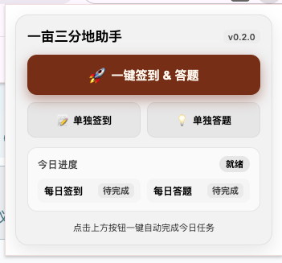
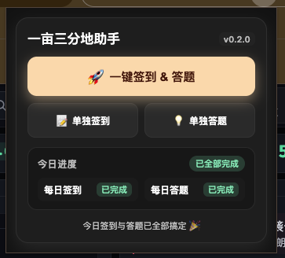
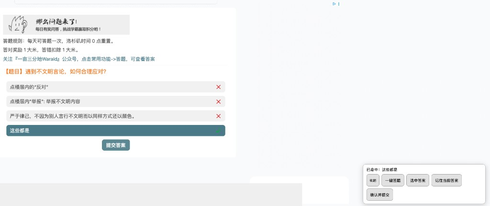
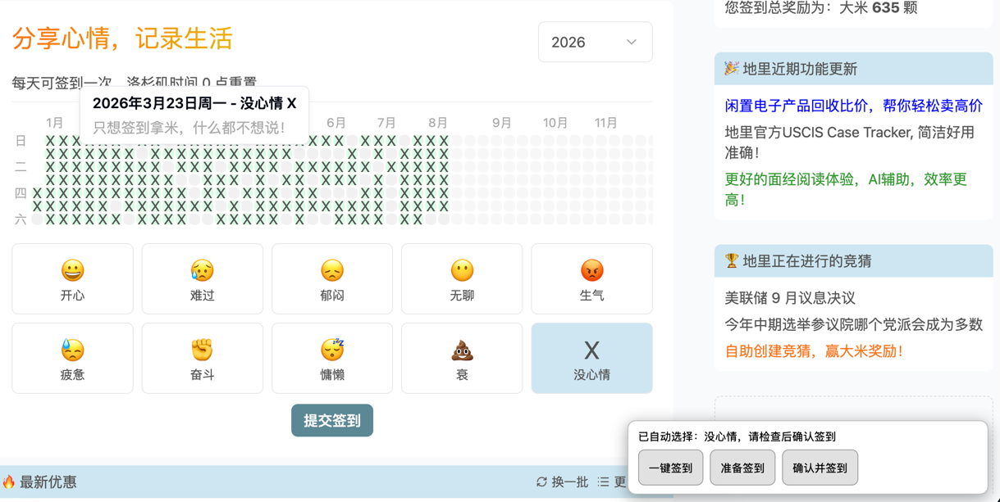

# 一亩三分地每日助手

当前版本 **v0.2.0**。这是一个 Manifest V3 Chrome 扩展，为一亩三分地的 `/next/daily-question` 和 `/next/daily-checkin` 页面提供本地学习、人工确认和一键自动流程辅助。它不替用户绕过站点流程。

## 安装

1. 打开 `chrome://extensions`，启用“开发者模式”。
2. 点击“加载已解压的扩展程序”，选择本项目目录 `/Users/mingjie/Documents/github/personal-projects/chrome-ext/一亩三分地-ext/`。
3. 打开扩展弹窗。弹窗提供核心【一键签到 & 答题】大按钮，辅以【单独签到】与【单独答题】备用操作。扩展申请 `storage`、`notifications` 和 `alarms` 权限，并仅请求 `1point3acres.com` 及 `www.1point3acres.com` 的站点访问权限；该站点权限用于让后台核验并关闭对应的签到/答题任务 tab。`notifications` 用于任务完成后的桌面系统通知，`alarms` 用于 service worker 休眠/重启后的结果收尾与已配置的持久化调度状态。

内容脚本同时匹配以下两组页面：

- `https://www.1point3acres.com/next/daily-checkin*`
- `https://www.1point3acres.com/next/daily-question*`
- `https://1point3acres.com/next/daily-checkin*`
- `https://1point3acres.com/next/daily-question*`

安装后如果修改了源文件，请在 `chrome://extensions` 点击扩展的“重新加载”，再刷新对应页面；只改代码不 reload extension，页面仍会继续跑旧脚本。

排错时必须确认加载或重新加载的是这个精确目录：`/Users/mingjie/Documents/github/personal-projects/chrome-ext/一亩三分地-ext/`。如果页面脚本 URL 是 `chrome-extension://.../build/content.js`，说明当前运行的不是本项目 `src/content.js`，请停用旧扩展、重新加载本目录，再 refresh 页面。

扩展图标使用一亩三分地 favicon 的本地派生图，并叠加红色斜杠/断裂标记；图标文件位于 `assets/`，由 scaffold 检查确认 16/32/48/128 四种尺寸均存在。

## 界面示例

1. 扩展弹窗

   

   v0.2.0 弹窗：主按钮【一键签到 & 答题】自动完成今日任务，也可【单独签到】或【单独答题】，并查看今日进度。

2. 完成效果

   

   今日签到与答题都完成后，进度显示「已全部完成」，底部提示「今日签到与答题已全部搞定」。

3. 答题

   

   每日答题页右下角工具栏。唯一命中时会勾叉高亮正确答案，并显示「已命中」状态。

4. 签到

   

   每日签到页的辅助操作界面，默认选择「没心情」后可确认签到。

## 使用流程

- 点击扩展图标打开 popup，点击【一键签到 & 答题】按钮即可在后台自动顺次完成今日签到与答题。
- 后台 workflow 自动打开或复用目标标签页，全部成功后自动关闭签到和答题这两个任务 tab，并发送桌面系统通知；它只会复用当前活动的目标页或扩展自己管理的目标页，不会接管用户放在后台的普通同址 tab。
- 遇阻保护：如果遇到未登录、验证码或题目未收录/多候选等情况，插件绝不会关闭标签页，而是自动将该标签页激活切到前台，在插件图标上显示 `!` 告警，并在 popup 弹窗中提供【👉 前往处理】按钮直达受阻页面。

完整顺序如下：

1. 后台打开或复用每日签到页。
2. 自动选择默认心情“没心情”。
3. 找到站点自己的签到按钮后提交。
4. 成功时，页面显示 3 秒 Toast，并发送一条系统通知。
5. 成功确认后关闭后台签到 tab，再进入答题页。
6. 后台打开或复用每日答题页。
7. 等待最多 5 秒让题目和选项加载并稳定；只有两次连续识别结果一致，才继续。
8. 题库唯一命中时，自动选中唯一匹配答案并自动提交。
9. 成功确认检测到“答题成功”或“今日已答题”后，关闭后台答题 tab。
10. 整个 workflow 成功结束时，再发送完成通知。

“3 秒”只指签到成功 Toast 的固定展示时长；首次打开答题页最多等待 5 秒。

页面内工具栏和 popup 后台 workflow 的区别如下：

- popup 后台 workflow：自动开页/复用、自动提交、成功确认后自动关闭目标标签页，并串行执行签到与答题。
- popup 的【单独签到】与【单独答题】：只执行被点击的阶段；成功后不会自动串起另一页面。若任务页是扩展新建且明确归扩展所有，成功后可以安全关闭；若是用户已有/复用的 tab，则保留页面。
- 手动打开页面后使用页面工具栏：只在当前页面内辅助选择、记住和提交，不会自动关闭这个 tab，也不会自动串起另一页面。
- 手动打开且未通过一键 workflow 管理的页面不会被关闭。

一键 workflow 使用严格的安全规则：

- 已签到：不重复提交，关闭签到 tab 后继续答题。
- 已答题：视为完成，并关闭后台答题 tab。
- 未登录：保留页面，不自动提交，不自动关闭 tab；登录后再继续。
- 验证码：保留页面，不绕过验证码；需要用户手动处理。
- 题库未收录：保留页面，不自动提交；用户可手动选择并保存。
- 题目精确命中但题库答案不在当前选项中：保留页面，不借用相似题目的答案；用户需核对官网题目/选项后手动处理。
- 如果该页是 popup 一键 workflow 管理的任务 tab，用户手动完成站点提交后，检测到站点成功状态也会自动关闭该 tab。
- 多候选：保留页面，不自动提交；用户需人工判断。
- 题目/选项变化、按钮不可用、页面 DOM 变化、提交失败、结果无法确认、超时：都保留页面，不会自动关闭。
- 登录暂停会在用户完成登录后继续恢复；非登录类失败、验证码、未命中、多候选和人工介入场景都会停止自动提交并保留当前标签页。

## 各分支行为

以下说明以当前代码真实行为为准。

### 签到阶段

- 成功：自动提交；显示 3 秒 Toast；发送一条系统通知；如果是 popup 后台 workflow，会关闭后台签到 tab 并继续答题。
- 今日已签到：视为成功；不重复提交；如果是 popup 后台 workflow，会关闭后台签到 tab 并继续答题。
- 一键 workflow 会接管签到和答题两个任务 tab：如果已经完成就直接关闭；如果尚未完成，则自动完成后再关闭，再进入下一阶段。
- 已签到后重新进入流程：不会卡住，会直接进入答题阶段。
- 未登录：不会自动提交；不会关闭 tab；用户需要先登录后重试。
- 验证码：代码不会绕过验证码。提交后如果站点要求验证码，页面会停留等待站点结果；用户需要在保留下来的页面完成验证码。若一直未出现成功信号，最终按超时失败处理。
- 提交失败 / 操作失败 / 系统错误 / 验证码错误：视为失败；不会关闭 tab；同一天内只会按有限次数重试，不会拖到第二天。
- 未找到“没心情”：不会自动提交；不会关闭 tab；用户需要手动选择心情并签到。
- 找不到可用签到按钮：不会自动提交；不会关闭 tab；用户需要手动点击站点签到按钮。
- 超时：不会关闭 tab；用户需要检查是否卡在验证码、登录态或官网渲染异常。
- 按钮不可用或 DOM 变化：不会自动提交；不会关闭 tab；用户需要刷新页面并按站点流程手动处理。

### 答题阶段

- 唯一命中且题目、选项在最长 5 秒的等待窗口内稳定：自动选中并自动提交。
- 答题成功：如果是 popup 后台 workflow，会关闭后台答题 tab，并发送完成通知。
- 今日已答题：视为成功；不重复提交；如果是 popup 后台 workflow，会关闭后台答题 tab，并发送完成通知。
- 已答题后重新进入流程：会直接结束并关闭后台答题 tab。
- 未登录：不会自动提交；不会关闭 tab；用户需要先登录后重试。
- 5 秒内题目或选项一直不稳定、没准备好或发生变化：不会自动提交；不会关闭 tab；用户需要刷新页面后重试。
- 题库未收录：不会自动提交；不会关闭 tab；用户需要手动选择正确答案，然后可点“记住当前答案”保存到本地题库。
- 题库有精确题目但答案不在当前选项：不会从相似题目借答案；不会自动提交或关闭 tab，用户需要先核对页面是否已更新。
- 题库未收录但在 popup 后台 workflow 的答题 tab 中手动提交成功：检测到站点显示“答题成功”或“今日已答题”后，会关闭该答题 tab 并完成流程。
- 多候选：不会自动提交；不会关闭 tab；用户需要人工判断正确答案，再手动选择；确认后也可以点“记住当前答案”。
- 命中后发现当前页面选项文本已变化、唯一匹配丢失或答案索引失效：不会自动提交；不会关闭 tab；用户需要手动检查并处理。
- 提交按钮不可用、消失或官网未确认已选中：不会自动提交；不会关闭 tab；用户需要手动选择或等待页面稳定后再提交。
- 验证码：代码不会绕过验证码。自动点提交后如果站点弹出或要求验证码，页面会保留；用户需要完成验证码并等待站点返回成功。
- 提交失败 / 操作失败 / 系统错误 / 验证码错误：视为失败；不会关闭 tab；同一天内只会按有限次数重试，不会拖到第二天。
- 超时：不会关闭 tab；popup 会显示需处理横幅并允许重试。用户需要检查是否卡在验证码、页面异步渲染或官网状态异常。

### 关闭 tab 规则

- popup 发起的一键 workflow 在成功确认后会关闭当前管理的任务 tab，包括它复用的用户任务页，以便进入下一阶段或结束流程。
- popup 的【单独签到】与【单独答题】只有在任务页是扩展新建且明确归扩展所有时才会在成功后关闭；复用的用户 tab 会保留。
- 任何失败、不确定结果、未登录，以及验证码、超时、题库未收录、多候选、按钮不可用、页面变化等场景，都不会自动关闭 tab。
- 手动打开的页面、以及只使用页面工具栏的场景，不会因为操作完成而自动关闭 tab。

## 页面工具栏

单独打开每日答题页时，页面右下角工具栏会自动显示当前命中状态和操作按钮：

- 命中状态文本
- 勾叉高亮提示
- `选中答案`
- `记住当前答案`
- `确认并提交`
- 以及额外的 `一键答题`

具体行为：

- 唯一命中时，工具栏会用勾叉样式标出题库命中的答案，并尝试自动选中；官网确认选中后会自动提交一次。状态文案会显示 `已命中：...` 或 `已自动选中：...`。
- `选中答案` 只负责再次点中命中的选项，不会直接提交。
- `确认并提交` 只会在官网已经确认该选项处于选中状态、且题目/选项没有变化时才触发官网提交。
- `记住当前答案` 会把当前页面“唯一已选中”的答案保存到本机 `chrome.storage.local`。
- 未收录或多候选时，工具栏不会提供自动提交路径，而是提示“请手动选择并保存，不能一键答题”。

单独打开每日签到页时，页面工具栏会自动显示：

- 当前签到状态
- `准备签到`
- `确认并签到`
- `一键签到`

其中默认会尝试自动选择“没心情”；如果页面结构变化导致识别不到，用户需要手动选择后再按站点流程提交。

## 题库与测试

题库是 `data/answer-bank.json`，由 `scripts/merge-bank.mjs` 根据脚本内来源生成；来源说明和许可证信息见 `data/SOURCES.md`。项目当前统计以 `data/merge-report.json` 为准：10 个成功来源、1304 条 raw records、198 个 normalized entries、11 个 ambiguous entries、4 个 cross-source conflicts。更新题库后应同时检查该 report 和来源文件。

运行全部静态测试：

```sh
for file in scripts/test-*.mjs; do node "$file"; done
find src scripts -type f \( -name '*.js' -o -name '*.mjs' \) -print0 | xargs -0 -n1 node --check
```

第二条命令在 macOS zsh 下使用 NUL 分隔文件名，覆盖 `src` 与 `scripts` 中实际存在的 `.js` 和 `.mjs` 文件。

本地也可单独运行 `node scripts/check-scaffold.mjs` 和 `node scripts/test-ui-docs.mjs`。

## 学习层、隐私与来源边界

学习答案只存本机 `chrome.storage.local`，不上传账号数据；扩展不接入 AI、不保存 Cookie、不调用旧 Firebase，也不使用远程服务或 `webRequest`；站点访问权限严格限于一亩三分地的两个域名。`notifications` 仅用于签到完成后的系统通知。题库来源文件可能没有统一许可证；除来源明确许可外，题库及派生数据仅作个人本地使用，请勿再分发，并自行遵守原项目许可证和站点条款。

扩展不绕过验证码或登录，不伪造站点请求，不模拟隐藏 API；所有提交都通过页面上可见的站点控件完成，不调用站点私有接口。

## 已知限制

扩展依赖官网当前 DOM、按钮文字和页面路径。官网改版、登录状态变化、验证码、异步渲染、题目切换或按钮重绘，都会导致无法识别、无法准备、不会自动提交，或者必须改为手动操作；遇到这种情况请刷新页面并按站点流程完成操作。

持久化自动调度接口只接受带有当天 `dateKey` 和 `nextRunAt` 的明确计划；未配置计划时保持关闭，不会自行创建或重复执行任务。自动调度遇到登录、验证码、题库不确定或其它不可安全重试的结果会停止并保留页面，需用户手动处理。
